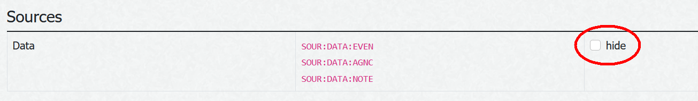
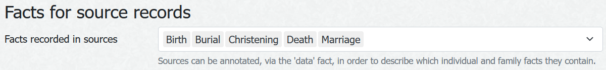
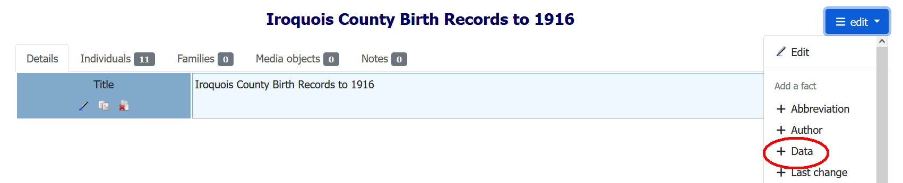

# ⚶ Vesta Research Suggestions (Webtrees 2 Custom Module)

This [webtrees](https://www.webtrees.net/) custom module provides suggestions for additional research, based on available sources.
It is helpful in particular if you have a large number of unsourced events (e.g. events initially taken over from another tree) which are expected to be covered by a manageable number of shared sources.
It may therefore be used to improve the overall data quality of a tree where source management has been neglected for some reason.
Note that the module does not provide research links in the form of search results from external services - This kind of functionality is planned for webtrees itself.

The project’s website is [cissee.de](https://cissee.de).

This is a webtrees 2.x module - It cannot be used with webtrees 1.x. There is no webtrees 1.x counterpart.

## Contents

* [Features](#features)
* [Download](#download)
* [Installation](#installation)
* [License](#license)

### Features<a name="features"/>

* In the extended 'Facts and Events' tab, if the 'Research Suggestions' checkbox is toggled, additional placeholder events are shown, indicating possible sources for the respective event. See below for two examples.

* Possible sources are also suggested when creating or editing an event: If you search for sources without entering a source name, suggested sources are returned if available (Otherwise, sources matching the entered name are returned as usual).

#### Annotating Sources

* How does this work? First, you have to annotate your sources in order to define the events recorded in the respective source. These annotations are primarily useful for sources which you expect to use for multiple individuals. They are part of the GEDCOM source data structure.
You have to activate the 'data' subtags in the GEDCOM Tags preferences (in the control panel), under 'Sources'.

* You may also adjust the types of events recorded in sources in your tree preferences.

* Now, when editing a source, you may add a 'data' object and list the types of events (such as births/christenings, marriages, deaths/burials), the date and the place (e.g. a county, or a parish) the source refers to. You can set multiple events with different dates and places, if necessary.

* The raw GEDCOM data should have a structure like this:

~~~~
1 DATA
2 EVEN CHR,MARR,BURI
3 DATE FROM 1765 TO 1852
3 PLAC Neuenkirchen (St. Bartholomäus)
2 EVEN CONF
3 DATE FROM 1841 TO 1852
3 PLAC Neuenkirchen (St. Bartholomäus)
~~~~

#### Evaluating Source Data

* The module then attempts to match events of individuals with sources annotated in this manner, by comparing the event type, date, and place.
* Note that higher-level places also match, if respective sources are available (see again the first example above).
* The module also integrates place hierarchy data from other custom modules (currently the Gov4Webtrees module). This is useful in cases where the administrative place hierarchy cannot be used to find a source, e.g. because the respective parish is in a different county, which wasn't uncommon in particular in [fragmented Central European territories](https://en.wikipedia.org/wiki/Kleinstaaterei). See the second example above (in which the settlemant itself at that time was in the Principality of Lippe-Detmold, while the church of its parish was in the Principality of Schaumburg-Lippe). In any case, the Gov4Webtrees module is useful to determine which parish a settement belonged to at a specific date.

### Download<a name="download"/>

* Current version: 2.1.20.1.0
* Based on and tested with webtrees 2.1.20. Requires webtrees 2.1.17 or later.
* Requires the ⚶ Vesta Common module ('vesta_common').
* Displays data via the ⚶ Vesta Facts and events module ('vesta_personal_facts').
* Download the zip file, which includes all Vesta modules, [here](https://cissee.de/vesta.latest.zip).
* Support, suggestions, feature requests: <ric@richard-cissee.de>
* Issues also via <https://github.com/vesta-webtrees-2-custom-modules/vesta_research_suggestions/issues>
* Translations may be contributed via weblate: <https://hosted.weblate.org/projects/vesta-webtrees-custom-modules/>

### Installation<a name="installation"/>

* Unzip the files and copy the contents of the modules_v4 folder to the respective folder of your webtrees installation. All related modules are included in the zip file. It's safe to overwrite the respective directories if they already exist (they are bundled with other custom modules as well), as long as other custom models using these dependencies are also upgraded to their respective latest versions.
* Enable the extended 'Facts and Events' module via Control Panel -> Modules -> All modules -> ⚶ Vesta Facts and Events.
* Enable the main module via Control Panel -> Modules -> All modules -> ⚶ Vesta Research Suggestions. After that, you may configure some options.
* Configure the visibility of the old and the extended 'Facts and Events' tab via Control Panel -> Modules -> Tabs (usually, you'll want to use only one of them. You may just disable the original 'Facts and Events' module altogether).

### License<a name="license"/>

* **vesta_research_suggestions: a webtrees custom module**
* Copyright (C) 2020 – 2024 Richard Cissée
* Derived from **webtrees** - Copyright 2022 webtrees development team.
* Dutch translations provided by TheDutchJewel.
* Czech translations provided by Josef Prause.
* Further translations contributed via weblate.

This program is free software: you can redistribute it and/or modify
it under the terms of the GNU General Public License as published by
the Free Software Foundation, either version 3 of the License, or
(at your option) any later version.

This program is distributed in the hope that it will be useful,
but WITHOUT ANY WARRANTY; without even the implied warranty of
MERCHANTABILITY or FITNESS FOR A PARTICULAR PURPOSE. See the
GNU General Public License for more details.

You should have received a copy of the GNU General Public License
along with this program. If not, see <http://www.gnu.org/licenses/>.
